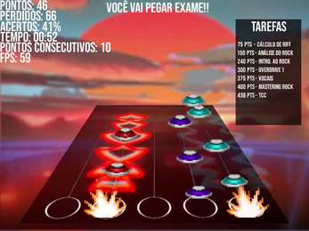

# Trabalho Final de Paradigmas de Programação

  

Neste trabalho final, foi feito um jogo utilizando a biblioteca LIBGDX disponível para Java.

O jogo está disponível para jogar online no itch.io [aqui](https://henrique-krever.itch.io/ufsm-rockstar).

## Objetivo
O objetivo do jogo foi exercitar uma linguagem nova, e uma biblioteca desconhecida por nós.
\
O jogo se baseia em graduar-se em Bacharelado do Rock na UFSM.
\
Quanto mais acordes você acerta mais pontos ganha, e assim completa tarefas da faculdade.
\
Mas cuidado! Não erre muito para não pegar exame e reprovar!
